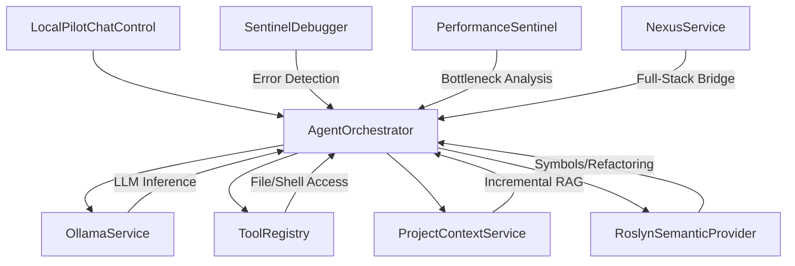

# LocalPilot Project Knowledge Graph

LocalPilot is a privacy-first, agent-driven AI pair programmer for Visual Studio. It leverages local LLMs (via Ollama) and deep IDE integration to provide autonomous coding capabilities.

## 🏗️ System Architecture

LocalPilot follows an **Agentic OODA Loop** (Observe, Orient, Decide, Act) architecture, tightly integrated with the Visual Studio SDK and Roslyn.

---

## 🧩 Core Services Map

| Service | Responsibility | Key Features |
| :--- | :--- | :--- |
| **AgentOrchestrator** | The "Brain". Manages the autonomous loop. | **Performance Shield**, **Context Budgeting**, Nexus summarization, OODA Orientation. |
| **GlobalPriorityGuard** | Resource Coordinator. | **Yield-on-Action**, 30s Smart Cooldown, immediate background task abortion. |
| **OllamaService** | LLM Interface. Communicates with local Ollama. | **Keep-Alive Tuning** (5m/10m VRAM), Native Tool Calling, Embedding support. |
| **ProjectContextService**| RAG Layer. Indexes solution for semantic search. | **Throttled Parallel Indexing**, Incremental Watcher, 256KB File Cap. |
| **NexusService** | Full-Stack Bridge. Maps dependencies. | **Incremental Graph Updates**, Parallel Initial Scan, C# to TS/TSX Bridge. |
| **RoslynSemanticProvider**| Semantic Intelligence. Uses MSBuild/Roslyn. | Neighborhood Context, Project-wide Rename, Semantic Diagnostics. |
| **ToolRegistry** | Capability Layer. Safe interfaces for the agent. | File I/O, Grep, Terminal, Unit Testing, Symbol Renaming. |
| **SentinelDebugger** | Self-Heal Watchdog. Monitors build errors. | Real-time "Fix with AI" proposals for compilation errors. |
| **PerformanceSentinel** | Proactive Optimization. Analyzes bottlenecks. | Detects O(n²) loops, blocking async, redundant allocations. |

---

## 🛠️ Agent Capability Suite (Tools)

The agent has access to several native tools via the `ToolRegistry`:

*   **FileSystem**: `read_file`, `write_file`, `list_directory`, `delete_file`.
*   **Search**: `grep_search` (High-perf parallel scan), `SearchContextAsync` (Vector RAG).
*   **Editing**: `replace_text` (Precise block replacement with CRLF/LF normalization).
*   **Development**: `run_terminal` (cmd.exe commands), `run_tests` (auto-detects toolchain).
*   **Nexus**: `trace_dependency` (Cross-stack path tracing), `analyze_impact` (Full-stack change impact analysis).
*   **Analysis**: `list_errors` (VS Error List access).

---

## 🎨 UI & Design Principles (Ghost UI)

The UI is built using **WPF** and adheres to the "Ghost UI" design mandate: minimalist, responsive, and natively theme-aware.

*   **ChatControl**: The primary container. Manages streaming narrative and activity logs.
*   **UI Virtualization**: Uses a virtualized `ItemsControl` for the **Activity Log**, ensuring **60fps scrolling** even with hundreds of tool logs.
*   **AgentTurnLayout**: Separates the **Narrative** (LLM text) from the **Activity** (Tool execution timeline).
*   **Human-in-the-Loop (HIL)**: A security layer requiring user approval for "risky" tools.
*   **Staged Review**: Custom diff view for multi-file changes before final acceptance.

---

## ⚡ Performance & Resource Management

1.  **VRAM Management**: Models are automatically unloaded from VRAM after 5-10 minutes of inactivity using `keep_alive` tuning.
2.  **I/O Efficiency**: **Incremental Syncing** via `FileSystemWatcher` ensures that only changed files are re-indexed for Nexus and RAG.
3.  **Parallelization**: Solution-wide scans utilize all available CPU cores via throttled `Parallel.ForEach` to avoid system lag.
4.  **Context Budgeting**: Agent prompts are kept lean by summarizing the Nexus graph and pruning large tool results.
5.  **Performance Shield**: For read-only actions (Explain, Document, Review), native tools are disabled and system prompts are stripped of "Worker" protocols to ensure near-instant responses.
6.  **Priority Guard**: All background services (RAG, Nexus) yield CPU/GPU resources immediately when an agent turn starts and for 30s after completion.
7.  **Quantization Recommendation**: Optimized for **q4_K_M** or **q5_K_M** GGUF models on local laptop hardware.

---

## 📂 Project Metadata (Internal)

*   **Directory**: `.localpilot/` (solution root)
*   **Nexus Graph**: `nexus.json` (Cross-language dependency map)
*   **Vector Index**: `index.json` (Semantic embeddings)
*   **Rules**: `LOCALPILOT.md` (Project-specific instructions)
