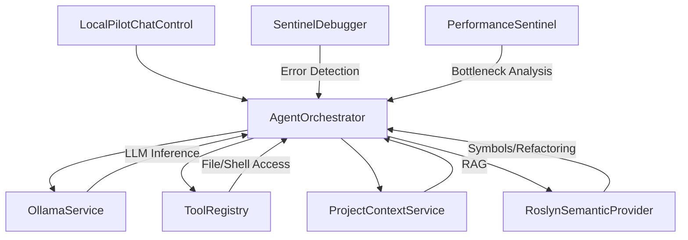

# LocalPilot Project Knowledge Graph

LocalPilot is a privacy-first, agent-driven AI pair programmer for Visual Studio. It leverages local LLMs (via Ollama) and deep IDE integration to provide autonomous coding capabilities.

## 🏗️ System Architecture

LocalPilot follows an **Agentic OODA Loop** (Observe, Orient, Decide, Act) architecture, tightly integrated with the Visual Studio SDK and Roslyn.

---

## 🧩 Core Services Map

| Service | Responsibility | Key Features |
| :--- | :--- | :--- |
| **AgentOrchestrator** | The "Brain". Manages the 20-step autonomous loop. | Native Ollama Tool Calling, Context Compaction, OODA Orientation. |
| **OllamaService** | LLM Interface. Communicates with local Ollama instance. | Streaming Support, Native Tool Calling support, Embeddings. |
| **ProjectContextService**| RAG Layer. Indexes solution for semantic search. | Differential sync, Hyper-compressed vector storage (.localpilot/index.json). |
| **RoslynSemanticProvider**| Semantic Intelligence. Uses MSBuild/Roslyn for accuracy. | Neighborhood Context, Project-wide Rename, Semantic Diagnostics. |
| **ToolRegistry** | Capability Layer. Safe interfaces for the agent to act. | File I/O, Grep, Terminal, Unit Testing, Symbol Renaming. |
| **SentinelDebugger** | Self-Heal Watchdog. Monitors build errors. | Real-time "Fix with AI" proposals for compilation errors. |
| **PerformanceSentinel** | Proactive Optimization. Analyzes C# for bottlenecks. | Detects O(n²) loops, blocking async, redundant allocations. |
| **ProjectMapService** | Structural Awareness. Generates solution headers. | Zero-latency folder structure mapping for LLM grounding. |

---

## 🛠️ Agent Capability Suite (Tools)

The agent has access to several native tools via the `ToolRegistry`:

*   **FileSystem**: `read_file`, `write_file`, `list_directory`, `delete_file`.
*   **Search**: `grep_search` (parallel scan), `SearchContextAsync` (semantic/vector).
*   **Editing**: `replace_text` (precise block replacement with normalization).
*   **Development**: `run_terminal` (cmd.exe commands), `run_tests` (auto-detects toolchain).
*   **Semantic**: `rename_symbol` (project-wide Roslyn refactoring).
*   **Analysis**: `list_errors` (VS Error List access).

---

## 🎨 UI & Design Principles (Ghost UI)

The UI is built using **WPF** and adheres to the "Ghost UI" design mandate: minimalist, responsive, and natively theme-aware.

*   **ChatControl**: The primary container. Manages streaming narrative and activity logs.
*   **AgentTurnLayout**: Separates the **Narrative** (LLM text) from the **Activity** (Tool execution timeline).
*   **AgentUiRenderer**: Renders tool execution badges, thinking states, and confirmation chips.
*   **Human-in-the-Loop (HIL)**: A security layer requiring explicit user approval for "risky" tools (`write_file`, `replace_text`, `run_terminal`).
*   **Staged Review**: Uses a custom diff view for multi-file changes before final acceptance.

---

## 💡 Key Coding Patterns

1.  **Threading**: Heavy use of `JoinableTaskFactory` to ensure UI interactions happen on the main thread while CPU/IO tasks run on background threads.
2.  **Normalization**: The `replace_text` tool uses sophisticated normalization to handle line-ending (CRLF vs LF) mismatches between LLM output and Windows files.
3.  **Deduplication**: The `AgentOrchestrator` implements "Context Compaction" and "System Prompt Deduplication" to keep the LLM context window clean.
4.  **Security**: Restricted access to the `.localpilot` directory via `IsInternalMetadata` in `ToolRegistry` to prevent agent "self-modification" or leakage of vector data.
5.  **Synchronization**: Files are read/written via VS TextBuffers when open in the editor to support undo/redo and live synchronization.

---

## 📂 Project Metadata (Internal)

*   **Directory**: `.localpilot/` (stored in solution root)
*   **Index**: `index.json` (Semantic embeddings)
*   **Rules**: `LOCALPILOT.md` (Project-specific instructions for the agent)
