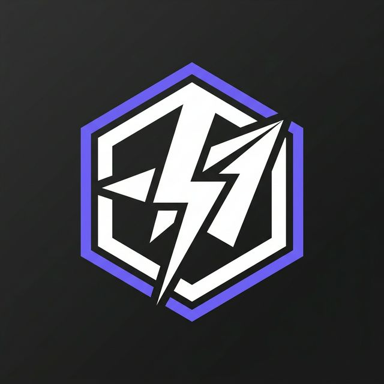
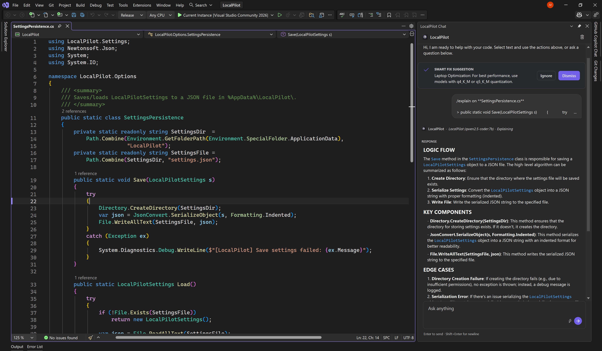
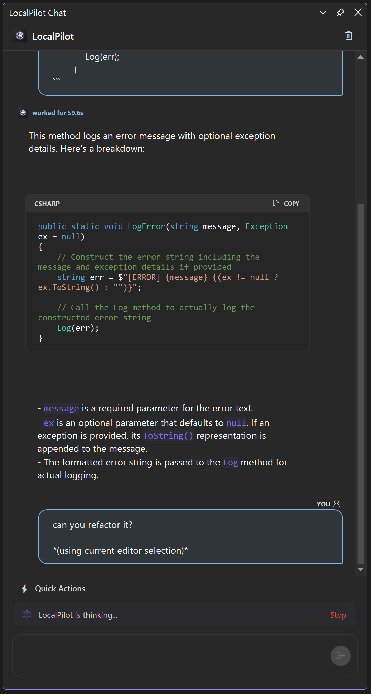
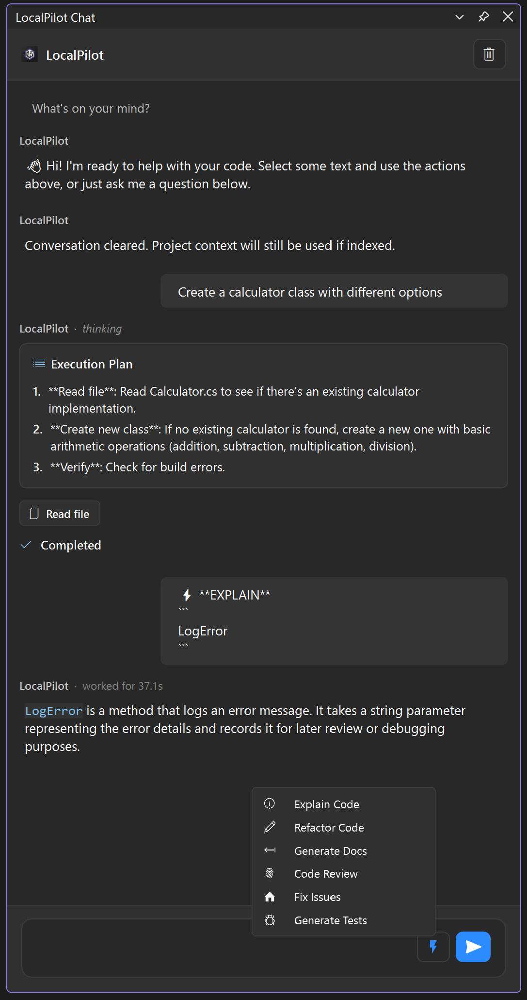
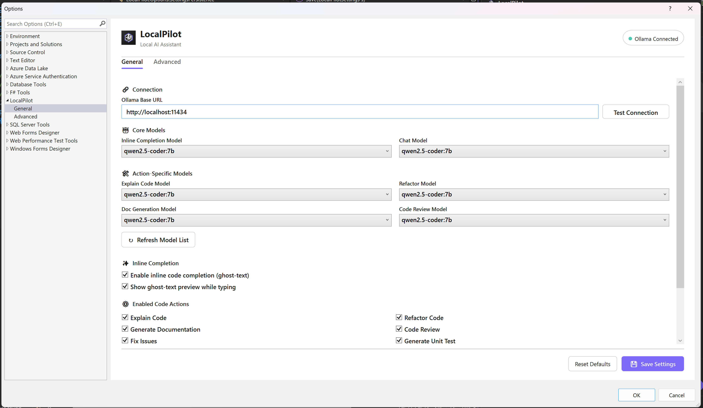

<div align="center">
  
  <h1>LocalPilot</h1>
  <p align="center">
    <strong>The Privacy-First AI Pair Programmer for Visual Studio.</strong><br />
    Bringing the power of local LLMs directly into your IDE with Ollama.
  </p>

  <p align="center">
    <a href="https://marketplace.visualstudio.com/items?itemName=FutureStackSolution.LocalPilotFSS">
      
    </a>
    <a href="https://github.com/FutureStackSolution/LocalPilot/blob/main/LICENSE">
      
    </a>
    <a href="https://ollama.com">
      
    </a>
    <a href="https://visualstudio.microsoft.com/">
      
    </a>
  </p>
</div>

---

## 🌟 Overview

**LocalPilot** is a powerful Visual Studio extension that integrates local Large Language Models (LLMs) via [Ollama](https://ollama.com). It provides a seamless, high-performance coding experience without the need for cloud-based subscriptions or data privacy concerns.

<p align="center">
  
</p>

---

## 🚀 Key Features

<table>
  <tr>
    <td width="50%" valign="top">
      <h3>💬 Advanced Chat Panel</h3>
      A dedicated side panel for complex reasoning, code generation, and deep-dive technical discussions.
      <br/>
            <br/>
      <p align="center">
        
      </p>
    </td>
    <td width="50%" valign="top">
      <h3>⚡ Contextual Quick Actions</h3>
      Instant access to Refactor, Explain, or Document code directly from your right-click context menu.
      <br/>
            <br/>
      <p align="center">
        
      </p>
    </td>
  </tr>
  <tr>
    <td width="50%" valign="top">
      <h3>🛠️ Flexible Configuration</h3>
      Easily manage your Ollama connection and assign different models for chat and autocomplete tasks.
      <br/>
            <br/>
      <p align="center">
        
      </p>
    </td>
    <td width="50%" valign="top">
      <h3>✨ Ghost-Text & Performance</h3>
      <ul style="list-style-type: none; padding-left: 0;">
        <li>🚀 <strong>Real-time Suggestions</strong>: Zero-latency inline code completions.</li>
        <li>🏠 <strong>100% Local</strong>: Your code never leaves your workstation.</li>
        <li>⚡ <strong>Optimized</strong>: Designed for minimal impact on IDE performance.</li>
      </ul>
    </td>
  </tr>
</table>


---

## 🛡️ Why LocalPilot?

- **🔒 Absolute Privacy**: Your source code stays on your machine. No telemetry, no cloud hooks, no data leakage. Perfect for enterprise and sensitive projects.
- **⚡ Zero Latency**: No waiting for cloud API responses. Local inference provides near-instantaneous completions.
- **💰 One-time Setup, Zero Cost**: No recurring subscriptions. Use the power of your own hardware to fuel your development.
- **🎨 Native Experience**: Designed to feel like a built-in Visual Studio feature, supporting both Light and Dark themes natively.

---

## 🛠️ Getting Started

### 1️⃣ Prerequisites
You must have **Ollama** installed and running on your machine.
- **Download**: [ollama.com](https://ollama.com)
- **Launch a Model**: We recommend code-centric models like `llama3`, `codellama`, or `phi3`.
  ```bash
  ollama run llama3
  ```

### 2️⃣ Installation
1. Visit the **[Visual Studio Marketplace](https://marketplace.visualstudio.com/items?itemName=FutureStackSolution.LocalPilotFSS)**.
2. Click **Download**, or search for "LocalPilot" within the Visual Studio Extension Manager:
   - *Extensions > Manage Extensions > Online*
3. Restart Visual Studio to complete the installation.

### 3️⃣ Configuration
Navigate to **Tools > Options > LocalPilot > Settings**.
1. **Ollama Base URL**: Usually `http://localhost:11434`. Click **"Test Connection"** to verify.
2. **Model Assignments**: Assign preferred models for **Chat** and **Inline Completions**.

> [!TIP]
> For optimal performance, use a lightweight model like `phi3` or `starcoder2:3b` for **Inline Completions**, and a larger model like `llama3:8b` or `deepseek-coder` for the **Chat Assistant**.

---

## 📖 Usage Guide

### 💡 Inline Completion
Simply start typing in any supported file. LocalPilot will provide translucent "ghost-text" suggestions.
- **`Tab`**: Accept the suggestion.
- **`Esc`**: Dismiss the suggestion.

### 💬 Chat Assistant
The dedicated AI chat panel can be summoned at any time:
- **Global Shortcut**: Press **`Alt + L`** to toggle the chat window.
- **LocalPilot Menu**: Access Chat and Settings directly from the top-level **LocalPilot** menu or the **Tools > LocalPilot** menu in Visual Studio.

### ⚡ Contextual Actions
Right-click on any code selection or use the **LocalPilot** menu to access:
- **Explain Code**: Breakdown complex logic.
- **Generate Docs**: Auto-generate XML/docstring comments.
- **Refactor**: Suggest improvements for readability and performance.

---

## 🤝 Contributing

We welcome community contributions! Whether it's bugs, features, or documentation, your help is appreciated.

### 🛠️ How to Help
1. **Check Issues**: See the [Existing Issues](https://github.com/FutureStackSolution/LocalPilot/issues) to avoid duplicates.
2. **Clear Reports**: For bugs, include your VS version, Ollama model, and reproduction steps.
3. **Pull Requests**: Create a branch from `main`, ensure the project builds, and submit your PR with a clear description.

---

## 💻 Hardware Requirements

Since **LocalPilot** runs Large Language Models (LLMs) **entirely on your local machine** via Ollama, your hardware performance directly impacts the speed and responsiveness of AI suggestions.

### 🏁 Minimum Requirements
*   **CPU**: Recent Multi-core processor (Intel i5/AMD Ryzen 5 or equivalent).
*   **RAM**: 8GB (16GB+ strongly recommended for a smooth experience).
*   **GPU**: 4GB VRAM (Dedicated NVIDIA or Apple Silicon GPU preferred for faster inference).
*   **Storage**: 5GB+ for model storage (SSD/NVMe highly recommended).

### 🚀 Recommended for "Pro" Experience
*   **RAM**: 32GB+ for handling larger models (13B+) alongside Visual Studio.
*   **GPU**: NVIDIA RTX 3060/4060 or higher with 12GB+ VRAM.
*   **NVIDIA CUDA**: Ensure latest drivers are installed for GPU acceleration.

> [!IMPORTANT]
> LocalPilot is designed for efficiency, but because it performs all AI processing locally, it requires capable hardware. If suggestions feel slow, consider using a smaller, quantized model (e.g., `phi3:mini` or `starcoder2:3b`) in the settings.

---

## 📜 Release History

### 🚀 v1.2 - The Aesthetic & Intelligence Update (latest)
**"A major leap in visual fidelity and user experience refinement."**

- **✨ High-Fidelity Syntax Highlighting**: New theme-aware code renderer with a custom regex engine for premium visualization of methods, types, and strings.
- **🎨 Theme-Aware Palette**: Deep integration with VS Dark and Light themes—colors automatically adapt to your environment for maximum readability.
- **⌨️ Global Access Shortcut**: Added **`Alt + L`** as the universal command to instantly summon the AI Chat panel.
- **📂 Dedicated LocalPilot Menu**: A new top-level **LocalPilot** menu is now available (also accessible via **Tools > LocalPilot**) for rapid access to chat and settings.
- **🖼️ Minimalist Branding**: Refined the chat interface by removing redundant text labels, focusing purely on a clean, icon-centric AI persona.
- **🧠 Intelligent Status Tracking**: Resolved the "sticky thinking" bug; the AI now correctly transitions from "thinking" to "worked for X.Xs" without clutter.
- **🛡️ Robust Stream Rendering**: Hardened the UI update loop against rapid-fire AI streaming, preventing flickering and ensuring smooth output.

### 🔨 v1.1 - The Stability Update
**"The production-ready overhaul focusing on reliability and UX."**

- **✅ Selection Deadlock Fix**: Fundamental refactor of selection capture to prevent UI thread hangs during Quick Actions.
- **✅ Live Markdown Engine**: New incremental renderer provides a premium "typing" experience with real-time headers and list formatting.
- **✅ Hardened Container Logic**: Resolved critical `NullReferenceException` and `ObjectDisposedException` errors during intensive AI streaming.
- **✅ Thread-Safe Diagnostics**: Refactored the internal logger to be non-blocking and safe for background AI operations.
- **✅ Pro Marketplace Branding**: Formally aligned all project identifiers with the official `FutureStackSolution` namespace.

### ✨ v1.0 - Initial Release
- **Inline Ghost-Text**: Real-time code completions via Ollama.
- **Interactive Chat Panel**: Full technical discussion window.
- **Context Menu Actions**: Explain, Document, and Refactor support.
- **Native VS Support**: Full theme awareness for Light and Dark modes.

